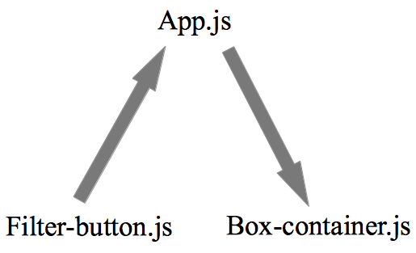

# Logo Design

The creation of this page was completed as a coding challenge for Bonfire Studios
in Andover, MA. In addition to building a pixel-perfect webpage from a photoshop
rendering, other challenges in this project included filtering the boxes displayed
on the bottom of the screen depending on whether the user desires to see even or odd
boxes, and creating a toggle effect through which the clicking of one filter
button deselects the others.


### Technologies Used

-   Adobe Photoshop
-   React.js
-   GitHub Pages

### SEO
As with any company's web page, if it can't be found in a web search, it's not
really worth having. As a tip-of-the-hat to the potential SEO needs of Logo Design,
a meaningful page title (under the recommended maximum of 50 characters) was added
to [index.html](./public/index.html),

```
Logo Design | Custom Graphic Design for Business
```
as well as a meta description which conveys the work of Logo Design while being
full of relevant key-words (just under the 250 maximum recommended characters)

```
Providing custom designs for Fortune 500s and start-ups alike for the past 25 years. Trust Logo Design's fast and effecient process to create a high quality, eye-catching logo that will represent your mission and business faithfully.
```

### Filtering and How
To understand what's going on here, we should first think of the relationship
between App.js, the filter buttons and the boxes being displayed, as a triangle.



The state for [App.js](./src/App.js) (which boxes are displayed and which button is selected) is
set with a default value when the page loads. When a user clicks on a filter button
the state of App.js is updated. This update causes App.js to pass the updated state
as a prop down to [box-container.js](./src/Boxes-Box_Container/box-container.js) which, in turn, determines which boxes to display using the function below:

```
const boxFilter = () => {
  if (filter.showAll){
    return boxData.map(box => (
      <Box
        key={box.id}
        title = {box.title}
        subtext = {box.subtext}
      />
    ))
  }else if (filter.showEven){
      const evenBoxes = boxData.filter(box => box.id % 2 === 0)
      return evenBoxes.map(evenBox => (
      <Box
        key={evenBox.id}
        title = {evenBox.title}
        subtext = {evenBox.subtext}
      />
    ))
  }else if (filter.showOdd){
      const oddBoxes = boxData.filter(box => box.id % 2 > 0)
      return oddBoxes.map(oddBox => (
      <Box
        key={oddBox.id}
        title = {oddBox.title}
        subtext = {oddBox.subtext}
      />
    ))
}
}
```
### Toggling the Filter Button

An additional challenge, and the final piece in the UI for filtering which boxes
are shown on the page, was toggling between the filter buttons. A smooth UI demanded
that the action of selecting one button automatically de-select another which,
in turn, required that the system have some memory of which button was currently
clicked. This adds an additional arrow to the chart above, turning the relationship between filter-button.js and App.js into a loop.


Clicking on the filter button updates the state of App.js (through hero.js) and that update determines which button displays as 'clicked' using these three functions in [hero.js](./src/hero.js):

```
const showAllClicked = () => (filter.showAll ? '-clicked' : '')
const showEvenClicked = () => (filter.showEven ? '-clicked' : '')
const showOddClicked = () => (filter.showOdd ? '-clicked' : '')
```
Each of these functions is run when the state of App.js is updated and so, since clicking a filter button updates the state, that update triggers the above functions.
These functions check to see what the current App.js state is and changes the css
class of the button accordingly.

## Future Work

-   Building out additional pages to be accessed by the nav-links
at the top of the page, as well as the 'view the case study' button at the bottom
of each of the boxes.
-   Work should also be done smoothing out the transitions in the rendering of the    filtered boxes, perhaps a quick fade-in could soften that experience.
