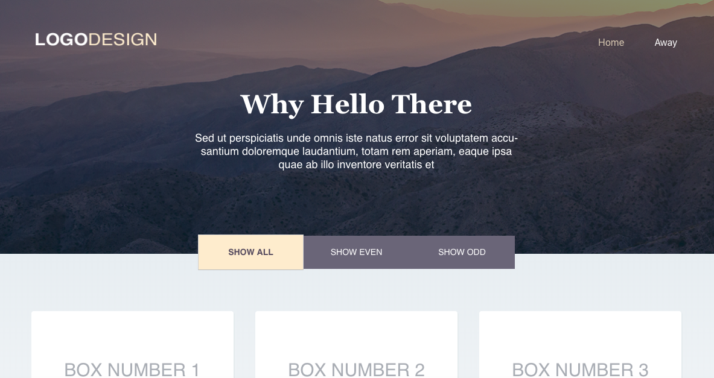

#Logo Design

The creation this page was completed as a coding challenge for Bonfire Studios
in Andover, MA. In addition to building a pixel-perfect webpage from a photoshop
rendering, other challenges in this project included filtering the boxes displayed
on the bottom of the screen depending on whether the user desires to see Even or Odd
titled boxes and creating a toggle effect through which the clicking of one filter
button deselects the others.



###Filtering
To understand what's going on here, we should first think of the relationship
between App.js, the filter buttons and the boxes being displayed, as a triangle.


The state for each of these components (which boxes are displayed) is set with
a default value when the page loads. When a user clicks on a filter button, that
action updates the state of App.js, this update causes App.js to pass this,
updated state, as a prop down to [box-container.js](./src/Boxes-Box_Container)
which, in turn, determines which boxes to display based off of the state using the function below:

```
const boxFilter = () => {
  if (filter.showAll){
    return boxData.map(box => (
      <Box
        key={box.id}
        title = {box.title}
        subtext = {box.subtext}
      />
    ))
  }else if (filter.showEven){
      const evenBoxes = boxData.filter(box => box.id % 2 === 0)
      return evenBoxes.map(evenBox => (
      <Box
        key={evenBox.id}
        title = {evenBox.title}
        subtext = {evenBox.subtext}
      />
    ))
  }else if (filter.showOdd){
      const oddBoxes = boxData.filter(box => box.id % 2 > 0)
      return oddBoxes.map(oddBox => (
      <Box
        key={oddBox.id}
        title = {oddBox.title}
        subtext = {oddBox.subtext}
      />
    ))
}
}
```
###Toggling the Filter Button
An additional challenge and the final piece in the UI for filtering which boxes
are shown on the page, was toggling between the filter buttons. A smooth UI demanded
that the action of selecting on button, automatically de-select another, which
in turn, required that the system have some memory of which button was currently
clicked so that the other. This adds an additional arrow to the chart above turning
the relationship between filter-button.js and App.js into a loop where clicking on
the filter button updates the state of App.js and that update in turn determines which
button displays as clicked using these three funcitons in [hero.js](./src/hero.js):

```
insert three functions from hero.js here
```
Each of these functions is run when the state is updated and so, since clicking a
filter button updates the state of App.js that update triggers these functions
which check to see what the current state is and changes the css class of the
button accordingly.

SEO


##Technologies
Adobe Photoshop
React.js
GitHub Pages
